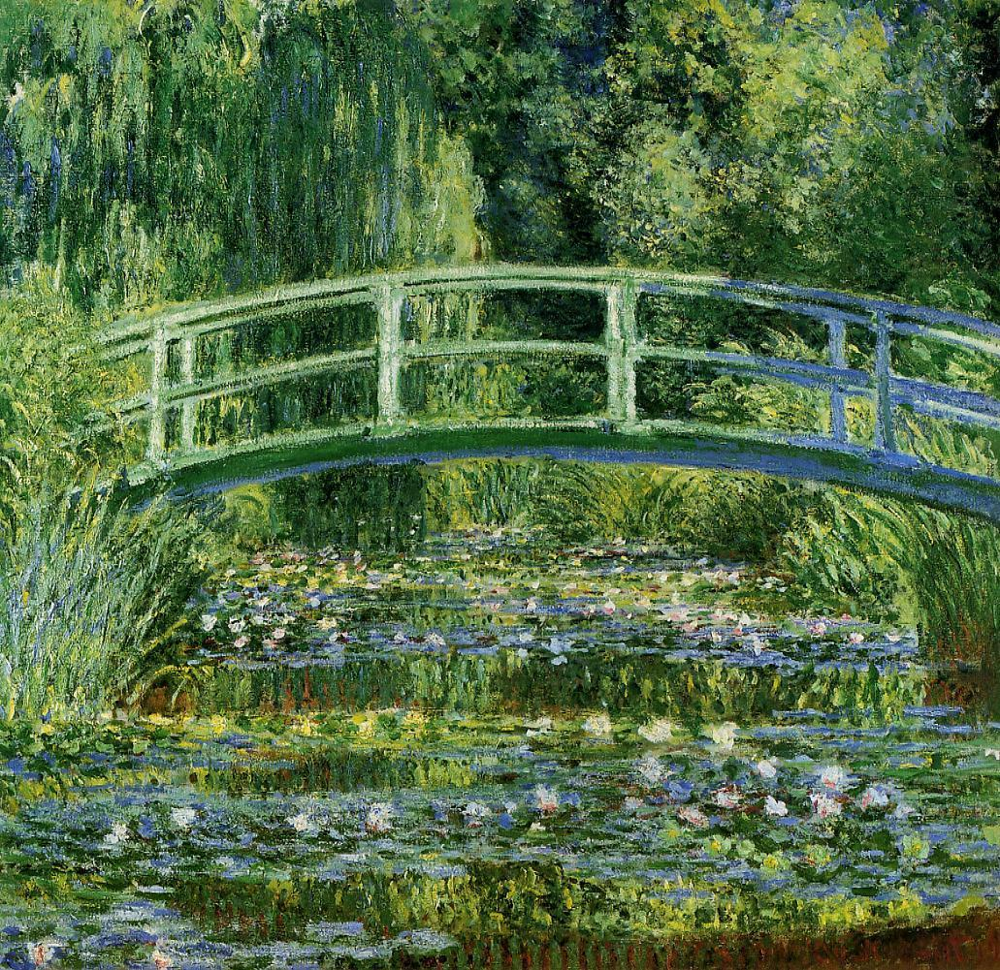
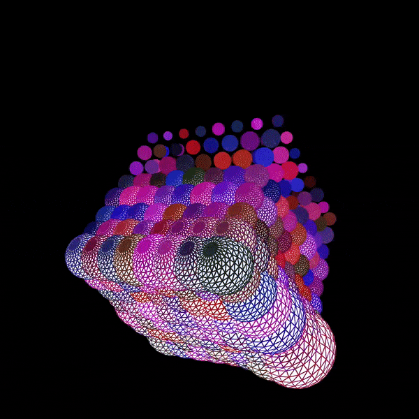

# IDEA9103 Creative Coding – Quiz 8

*Welcome! This README provides some inspiration and conceptual directions for the project, including different artwork proposals, how they might be presented, and why they are meaningful inspirations for the creative coding experience.*

## Part 1 – Imaging Technique Inspiration

### Visual Inspiration: Painterly Light, Sound Reflection, and Atmospheric Motion

Artworks are created with **meanings, emotions, and personal expression**. They act as visual representations of the artist’s feelings and voice through the use of **colour, shapes, movement, and composition**. For more than a century, audiences have viewed paintings through static images, often wondering what happened within the scene, why certain emotions were expressed, and how different viewers may interpret the artwork from their own perspective.

For my imaging technique inspiration, I am interested in the **painterly use of light, colour reflection, movement, and atmosphere** within post-impressionist landscape paintings. I am particularly inspired by the idea of making the painting feel alive, as if moments inside the artwork are continuously moving within the frame. These artworks transform natural environments into **eternal, emotional, immersive, and atmospheric visual experiences**.

Rather than recreating a similar painting directly, I would like to borrow the visual language and stylistic qualities of these artworks, including **glowing lights, flowing brushstroke textures, shimmering water reflections, and strong colour contrast**. These techniques could strongly benefit our group’s creative coding project because they support an **immersive, memorable, and interactive visual system**, where elements such as movement, sound, rhythm, and environmental effects can influence motion, brightness, and visual rhythm, allowing the painting to feel alive while still preserving its original artistic identity.

---

## Reference Image 1 – Starry Night

**Technique focus:** swirling night atmosphere, glowing stars, expressive brushstroke direction and clarity, rhythmic visual movement, and environmental audio such as boat or ferry sounds.

---

## Reference Image 2 – Water Lilies and Japanese Bridge

**Technique focus:** soft reflections, layered colours, gentle water movement, immersive environmental atmosphere, and ambient sounds such as insects, nature, and footsteps.

---

## Key Visual Qualities I Want to Explore

I would like to pay respect to these paintings by preserving their original visual appearance while introducing subtle interactive elements that make the scenes feel alive and continuously active within the frame.

To achieve this, I would like to explore:

1. **Glowing light effects** that could respond to audio volume.
2. **Flowing brushstroke-like movement** driven by rhythm or frequency.
3. **Shimmering water reflections** that react to bass or lower frequencies.
4. **Atmospheric colour transitions** between calm and intense moments.
5. **Generative visual motion** that feels organic rather than mechanical.
6. **Environmental sound interaction** to strengthen immersion and emotional atmosphere.

## Part 2 – Coding Technique Exploration

Our group has already finalised and assigned different creative directions for the design project. I have been assigned the role of **Audio: Use the level or frequency content of an audio track to drive your mechanic**, and therefore I will be exploring how sound could be used to make the painting feel alive, immersive, and continuously moving.

Through a variety of research explorations, I became interested in **audio reactive visualisation**. This technique uses sound data, such as **volume, rhythm, and frequency**, to control visual elements in real time. It could help me achieve my inspiration by allowing the painting to respond dynamically to audio. For example, louder sounds could make environmental or street lights become brighter, bass frequencies could create larger water ripples or wave movements, and higher frequencies could trigger small brushstroke animations or sparkling effects.

This technique strongly supports my concept because it transforms a silent artwork into an **immersive, emotional, and interactive visual experience** while still preserving the original atmosphere and artistic identity of the painting.

---

## How This Technique Could Connect to My Visual Concept

Using this technique, the artwork could possibly:

1. *Control the brightness* of stars, streetlights, sunlight, and reflections using audio **volume**.
2. *Influence water ripples and heavier wave movements* using bass or **lower frequencies**.
3. *Create small sparkles or clearer brushstroke movement* as **frequencies** become higher.
4. *Guide the speed of movement* inside the painting using **rhythm**.
5. **Add environmental sounds**, such as insects, footsteps, beach sounds, people talking, or natural ambience, to make the artwork feel more alive and atmospheric.

By doing this, the artwork could encourage younger generations and modern audiences to engage with traditional paintings through a more contemporary, interactive, and imaginative experience.

---

## What is Audio Reactive Visualisation using p5.js?

**Example implementation:**
[Creative Coding with Codecademy #8: Audio Visualizations with p5.sound.js by codecademy](https://www.youtube.com/watch?v=p8nCYCfxOhw)

**Example codes:**
[Audio Reactive Visuals by p5.js Web Editor](https://editor.p5js.org/austinzhangmusic/collections/HBVLL4IQ0)

*Although the example uses microphone input, the same audio-reactive principle could also be applied to a pre-recorded audio track. In both cases, sound data such as volume, rhythm, and frequency can be analysed and mapped to visual elements.*